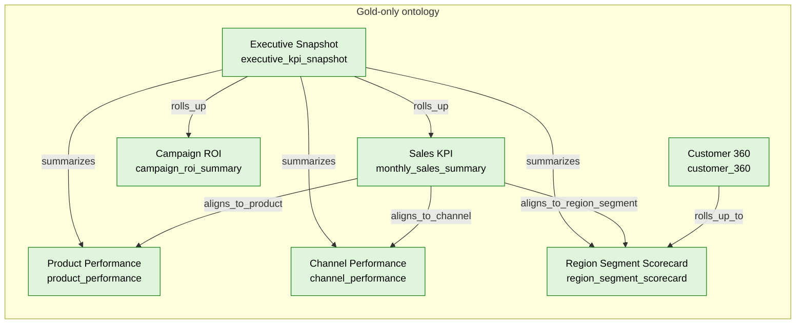

# Fabric Sales Demo

Synthetic Goldman Marcus-style sales dataset for Microsoft Fabric demos.

This repository contains a deterministic sample dataset and Fabric-oriented assets for a medallion architecture demo:

- **Bronze**: raw customer, sales, campaign, and web event extracts.
- **Silver**: cleaned dimensional model tables.
- **Gold**: business-ready sales, customer, campaign, product, channel, and executive aggregates.
- **Ontology**: Gold-layer entities, relationships, business terms, and metric definitions for semantic modeling.

All data is synthetic and generated locally. It is not sourced from Goldman Sachs, Marcus, or any real customer system.

## Quick start

```powershell
python scripts\generate_sample_data.py
```

The script writes CSV files into `data\bronze`, `data\silver`, `data\gold`, and `data\ontology`.

## Suggested Fabric demo flow

1. Create a Fabric Lakehouse named `fabric_sales_demo`.
2. Upload the CSV files under `data\bronze`, `data\silver`, and `data\gold`.
3. Use `fabric\notebooks\01_load_to_lakehouse.py` as starter PySpark code to create Delta tables.
4. Use `sql\gold_views.sql` as a SQL analytics endpoint example for Power BI semantic modeling.
5. Use `ontology\sales_ontology.json`, `ontology\sales_ontology_graph.mmd`, and `data\ontology\*.csv` as Gold-layer business ontology inputs for documentation, governance, graph, or Fabric Data Agent demos.

## End-to-end user journey

### 1. Get the data into Fabric Lakehouse

Create a Fabric workspace and Lakehouse named `fabric_sales_demo`, then upload the repository `data` folder into the Lakehouse `Files` area so the paths look like:

```text
Files/data/bronze/*.csv
Files/data/silver/*.csv
Files/data/gold/*.csv
Files/data/ontology/*.csv
```

Run `fabric\notebooks\01_load_to_lakehouse.py` in a Fabric notebook attached to the Lakehouse. The notebook loads bronze, silver, gold, and ontology CSVs into managed Delta tables.

### 2. Create the analytics model

Use the SQL analytics endpoint or Power BI Direct Lake to create a semantic model over the silver and gold tables.

Recommended model shape:

| Type | Tables |
| --- | --- |
| Dimensions | `dim_customer`, `dim_product`, `dim_channel`, `dim_date` |
| Facts | `fact_sales`, `fact_campaign_touch`, `fact_web_event` |
| Gold aggregates | `gold_monthly_sales_summary`, `gold_customer_360`, `gold_campaign_roi_summary`, `gold_product_performance`, `gold_channel_performance`, `gold_region_segment_scorecard`, `gold_executive_kpi_snapshot` |
| Gold ontology | `ontology_entities`, `ontology_relationships`, `ontology_metrics`, `ontology_business_terms`, `ontology_graph_nodes`, `ontology_graph_edges` |

Core measures:

```DAX
Applications = SUM(gold_monthly_sales_summary[applications])
Funded Sales = SUM(gold_monthly_sales_summary[funded_sales])
Sales Amount = SUM(gold_monthly_sales_summary[sales_amount])
Estimated Revenue = SUM(gold_monthly_sales_summary[estimated_revenue])
Conversion Rate = DIVIDE([Funded Sales], [Applications])
New Customer Sales = SUM(gold_monthly_sales_summary[new_customer_sales])
Campaign ROI Index = DIVIDE(SUM(gold_campaign_roi_summary[attributed_revenue]), SUM(gold_campaign_roi_summary[touches]) * 7.5)
```

### 3. Build the report

Create a Power BI report with four pages:

| Page | Purpose | Suggested visuals |
| --- | --- | --- |
| Executive Overview | Landing-page view of overall business health | KPI cards from `gold_executive_kpi_snapshot`, monthly sales trend, conversion rate trend |
| Sales Performance | Product, channel, region, and segment analysis | Matrix by product and channel, region map, segment slicer, sales funnel |
| Campaign ROI | Marketing performance and attribution | Campaign ROI table, conversion trend, attributed revenue by channel |
| Customer 360 | Customer value and engagement analysis | Customer table, engagement score distribution, revenue per customer by segment |

### 4. Add the ontology

Use `ontology\sales_ontology.json` as the canonical Gold-layer business ontology. Load `data\ontology\*.csv` into Fabric to make the Gold ontology queryable alongside the model. Use the graph node and edge tables for graph visualization, lineage discussions, or KQL graph demos.

The ontology defines:

- Business entities: Executive Snapshot, Sales KPI, Customer 360, Campaign ROI, Product Performance, Channel Performance, and Region Segment Scorecard.
- Relationships: executive rollups, KPI-to-product alignment, KPI-to-channel alignment, KPI-to-region/segment alignment, and Customer 360 rollup to region/segment scorecards.
- Metrics: applications, funded sales, sales amount, estimated revenue, conversion rate, new customer mix, campaign ROI, and revenue per customer.
- Terms: application, funded sale, sales amount, estimated revenue, digital engagement score, and attributed revenue.

### 5. Create a Fabric Data Agent

Create a Fabric Data Agent over the semantic model and include the Gold ontology tables as grounding context. Seed it with business-friendly instructions like:

```text
You are a sales analytics assistant for the Fabric Sales Demo.
Use the ontology tables to explain business terms, entity relationships, and metric definitions.
Use only gold tables for ontology-grounded answers. Do not describe the ontology in terms of silver facts or dimensions.
When users ask about revenue, use Estimated Revenue unless they explicitly ask for Sales Amount.
When users ask about marketing effectiveness, use Campaign ROI Index and campaign conversion rate.
```

Example prompts to validate the agent:

```text
What drove estimated revenue this month?
Which customer segments have the highest conversion rate?
Which campaign channel has the best ROI index?
Explain how Campaign Touch relates to Sales.
Show product performance by funded sales and new customer mix.
```

### 6. Integrate with Cowork

Use the Fabric Data Agent as the analytics endpoint for Cowork so users can ask sales questions from the flow of work. Recommended integration pattern:

1. Publish the Power BI report and Fabric Data Agent in the same Fabric workspace.
2. Add report links and sample prompts to the Cowork space or tab.
3. Configure Cowork to route sales analytics questions to the Fabric Data Agent.
4. Use the ontology terms and graph as grounding content so Cowork responses explain metrics consistently.
5. Pin the executive overview report and the Data Agent prompt starters for business users.

Suggested Cowork prompt starters:

```text
Summarize sales performance for this reporting period.
What are the top risks and opportunities by customer segment?
Which product should the sales team prioritize next week?
Explain the sales ontology and show how campaign ROI is calculated.
Draft an executive update using the gold KPI snapshot.
```

## Ontology graph



## Dataset themes

The sample models a consumer banking sales motion for products like savings, CDs, personal loans, investment accounts, and credit cards. It includes:

- Sales transactions and funded volume.
- Customer segmentation and digital engagement.
- Marketing campaign touches and attributed revenue.
- Gold-level KPIs by month, segment, channel, region, product, campaign, and executive snapshot.

See `docs\data_dictionary.md` for table details and `docs\ontology.md` for the business ontology.
